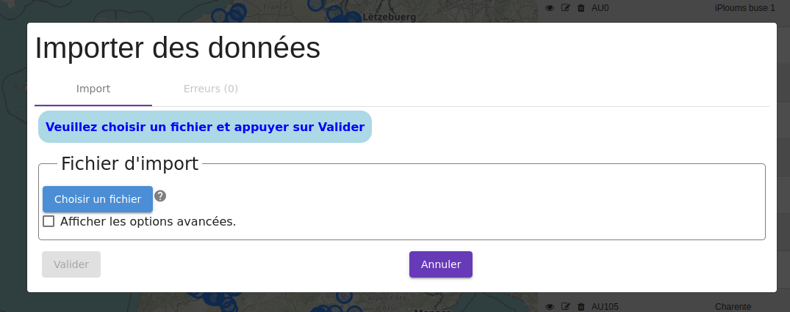
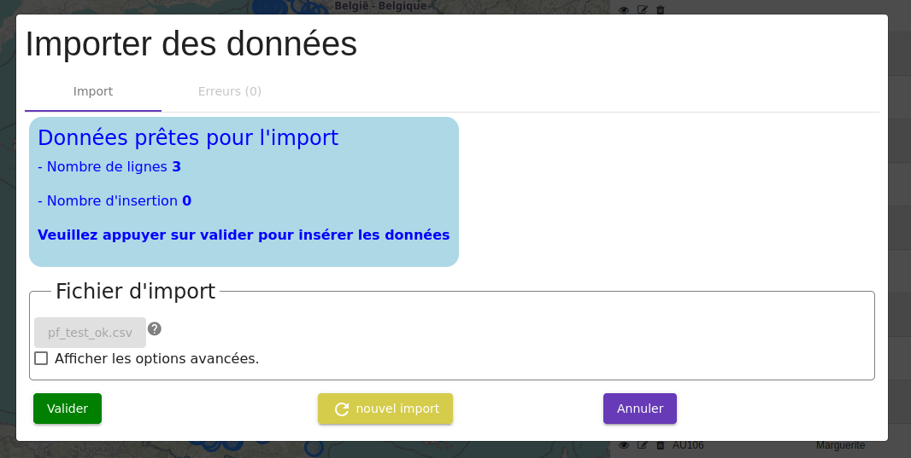
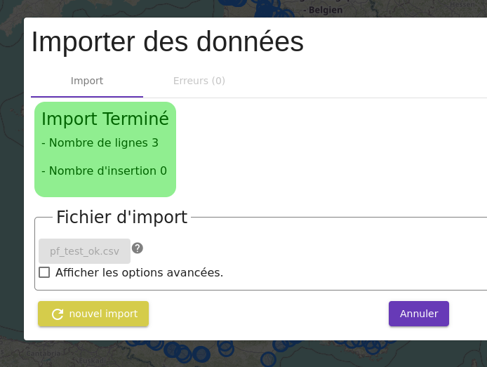
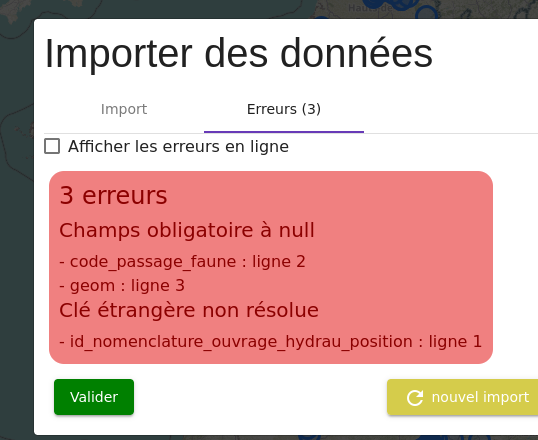

# Impot de passage faune

## Définition des champs

[Définition des champs](./import_description_champs.md)

## Exemples de fichiers

- [Exemple simple](/backend/gn_modulator/tests/import_test/pf_simple.csv)
- [Exemple complet](/backend/gn_modulator/tests/import_test/pf_complet.csv)
## Procédure d'import sur l'interface web

### Accès au menu d'import

Si l'utilisateur possède des droits de création pour ce module, alors le bouton d'import est visible.

Le menu d'import apparait dans une fenêtre modale.

### Chargement du fichier

- Appuyer sur le bouton `Charger un fichier`.
- Selectionner un fichier CSV
- Appuyer sur `Valider` pour charger le fichier.

### Vérification

- Une fois le fichier chargé, des informations sont affichées pour voir :

  - le nombre de données (lignes) du fichier
  - le nombre de lignes à ajouter
  - le nombre de ligne existantes (et éventuellement à modifier)

### Insertion des données

- Appuyer sur `Valider` pour insérer les données
- Un message de confirmation est affiché pour préciser le nombre de lignes ajoutées / modifiées

- Appuyer sur le bouton `Nouvel import` pour procéder à un nouvel import
- Apputer sur `Annuler` ou cliquer en dehors de la fenêtre modale pour sortir de l'import et reprendre la navigation.

### Erreurs

En cas d'erreur(s), un message est affiché et il faut aller dans l'onglet `Erreurs` pour voir les détails.

Il faudra revoir et corriger les données pour pouvoir reprocéder à l'import.

### Options additionelles

- `Verifier avant insertion`
  - décocher pour passer à l'étape de vérification des données et ne plus avoir à valider une fois le fichier chargé
<!-- - `Autoriser les mises à jour`
  - par défaut les mises à jour ne sont pas autorisées
  - appuyer sur cette case pour pouvoir mettre à jour des données -->
- `SRID`
  - par défaut le SRID est `4326`
    - vous pouvez préciser un SRID différent pour le fichier
