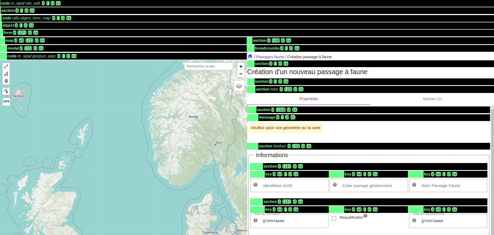

# Présentation

## Module de passage à faune

demo

## Configuration

### Structure du module

```
- setup.py

# modeles, migration, routes
- backend/ 

- config/
    - m_sipaf.module.yml

    # informations sur les tables
    - definitions/
        - m_sipaf.pf.schema.yml
        - ...

    # données pour le module (nomenclature, permission etc..)
    - features/
        - m_sipaf.utils.data

    # frontend
    -layout/
        - m_sipaf.site_list
        - m_sipaf.site_edit
        - m_sipaf.site_details
        - ....
```

### Fichier *module* `m_sipaf.module.yml`

#### Information `gn_commons.t_modules`

```
module:
  module_label: Passages faune
  module_desc: Module permettant la visualisation et la gestion des passages à Faune de France
  module_picto: fa-road
  active_frontend: true
```

#### Objects de module

```
objects:
  site:
    schema_code: m_sipaf.pf
    cruved: CRUIDE
  diagnostic:
    schema_code: m_sipaf.diag
    cruved: CRUD
....
```

Permet d'accéder à l'api générique `/modulator/rest/<module_code>/<object_code>` pour les actions définies dans le cruved pour le module m_sipaf ces objects.

- `/modulator/rest/m_sipaf/site`
- `/modulator/rest/m_sipaf/diagnostic`

#### Arborescence du module

```
tree:
  site:
    diagnostic:
```

#### Pages

```
pages_definition:
  site:
    list:
      root: true
    create:
      layout:
        code: m_sipaf.site_edit
    edit:
    details:
```

- `url`: `modulator/<module_code>/<object_code>_<page_type>/<value>`
- `layout_code`: `<module_code>.<object_code>_<page_type>`

- liste de site
    - `url`: `modulator/m_sipaf`
    - `layout_code`: `m_sipaf.site_list`

- details d'un site
    - `url`: `modulator/m_sipaf/site_details/<value>`
    - `layout_code`: `m_sipaf.site_details`

- création d'un site
    - `url`: `modulator/m_sipaf/site_create`
    - `layout_code`: `m_sipaf.site_edit`


#### Schema informations sur les tables

```
meta:
    model: m_sipaf.models.PassageFaune
    module_code: m_sipaf
    genre: M
    label: passage à faune
    labels: passages à faune
    label_field_name: id_passage_faune
    geometry_field_name: geom
    unique:
        - uuid_passage_faune
properties:
  ...
  uuid_passage_faune:
      title: Identifiant UUID
      description: Identifiant universel unique au format UUID (uuid_pf). Généré automatiquement si non renseigné.
  ...
  id_nomenclature_ouvrage_specificite:
      title: Spécificité du passage faune
      description: Exclusivité pour le passage faune (specificite)
  ...
  nomenclatures_ouvrage_type:
      title: "Type d'ouvrage"
      description: "Type d'ouvrage d'art (lb_type_ouvrage)"
```

#### Features

- Ajout de nomenclatures spécifiques pour les passages à faune.

```
- schema_code: ref_nom.type
    keys: [mnemonique, label_default, definition_default]
    defaults:
      source: SIPAF
    items:
      - [PF_OUVRAGE_MATERIAUX, Matériaux, "Matériaux composant l'ouvrage"]
      ...
  - schema_code: ref_nom.nomenclature
    defaults:
      source: SIPAF
      active: true
    keys:
      [id_type, cd_nomenclature, mnemonique, label_default, definition_default]
    items:
      - [PF_OUVRAGE_MATERIAUX, BET, Bét., Béton, Béton]
      ...

```

- Ajout de permissions pour le module

```
  - schema_code: perm.perm_dispo
    defaults:
      id_module: m_sipaf
    keys: [id_object, id_action, scope_filter, label]
    items:
      - [ALL, C, true, "Créer et importer des passages à faune"]
      - [ALL, R, true, "Voir les passages à faune"]
      - [ALL, U, true, "Modifier les passages à faune"]
      - [ALL, D, true, "Supprimer des passages à faune"]
      - [ALL, E, true, "Exporter les passages à faune"]

```


## Api générique

`/modulator/rest/<module_code>/<object_code>`

### Procédure de création d'un requête

- gestion des champs demandés
   - `jointures` + `load_only`
- prefiltrage
  - permission, scope et +
  - `prefilters`
- calcul nombre de lignes total
- `filters`
- calcul nombre de lignes filtrée
- tri, pagination...
- `raiseload`

### Retour:
- liste
- nombre total (prefiltré)
- nombre filtre

### Filtres et prefiltre

#### Exemples

- Nomenclature
  - prefiltre sur le type de nomenclature

- Pour un select sur des communes.
  - prefiltre sur le type de zonage
  - filtre sur le nom de la commune

### Paramètres

#### `fields`

- `id_passage_faune,nomenclatures_ouvrage_categorie.label_fr,scope`

- champs autorisés
  - ceux qui sont dans les définitions du frontend
  - formulaires -> autorisés en édition
  - vérification dans les décorateurs de route

#### `filters` `prefilters`

#### Exemples


- Recherche sur les communes du département lozère et contenant le mot `flo`
- `filters=area_code like 48%,name_code ~ flo`
- `prefilters=area_type.type_code = COM`
- `~` équivalent à `ILIKE` + `UNACCENT`

- Recherche sur les infrastructures (groupe de lineaires) appartenants aux régions Auvergne- Rhône-Alpes, Bourgogne
- `filters=linears.areas.id_area in 34946;34938`

- filtre geographiques `DWITHIN`, `BBOX`

#### `sort`

- `nom_passage_faune`
- `nom_passage_faune-`, décroissant


Pour les infrastructures A1, A10, A7, N10, N100, N11, N20`

- `code*`:
  - tri par lettre puis par nombre A1 => `A`, `1`
  - A1, A7, A10, N10, N11, N20, N100...

- `code*-`


## Frontend

### Elements de base

#### Sections

Contenant pour un ensemble d'élément

```
    title: 'Titre de la section
    items:
        ...
```

Peut être disposé de façon horizontale

```
    title: 'Titre de la section
    direction: row
    items:
        ...
```

Peut être affiché sous forme d'onglets

```
    title: 'Titre de la section
    display: tabs
    direction: row
    items:
        ...
```


#### Formulaires

```
 title: Formulaire
 type: form
 items:
    - key: a
      title: A
      type: string
    - key: b
      title: A
      type: number
    - key: c
      title: C
      type: datte
```

#### Carte

type: map
zoom: 10
center: [45, 0]
items:
    ...

### Element `object` de module

- méthode chargement des données, appel à l'api, gestion des filtres, prefiltres
- |`display`
  - geojson: affichage dans un élément carte
  - table: tableau de données
  - layout specifique (details, edition/creation)

### Paramètres dynamiques

```
type: form
    - key: param_1
      type: string

    - key: param_2
      type: string
      hiden: __f__data.param_1 == 'a'
      disabled: |
        __f__{ 
            console.log('test dynamic', data);
            return data.param_1 == 'b';
        }
```

Compsant `select` pour les filtres sur les infrastructures

```
            - key: infrastructures
              title: Infrastructure(s)
              type: list_form
              object_code: ref_geo.linear_group
              module_code: __REF_MODULE_CODE__
              multiple: true
              sort: code*
              reload_on_search: true
              filters: |
                __f__{

                  if(!data) {
                    return "";
                  };

                  const filters = [];

                  if (data.infrastructure_types?.length) {
                    const f = `linears.id_type in ${data.infrastructure_types.join(';')}`;
                    filters.push(f);
                  };

                  let z_values = data.communes?.length
                    ? data.communes
                    : data.departements?.length
                    ? data.departements.map(v => v.id_area)
                    : data.regions?.length
                    ? data.regions.map(v => v.id_area)
                    : null
                  ;

                  if (z_values) {
                    const f = `linears.areas.id_area in ${z_values.join(';')}`
                    filters.push(f);
                  };

                  return filters.join(',');

                }
              page_size: 20
```

### template

#### Definition de template

- geojson pk/pr (`m_sipaf.geojson_pkpr.layout.yml`)

```
layout:
  - type: object
    hidden: __f__!context.map_params?.bounds_filter_value
    display: geojson
    object_code: ref_geo.point
    module_code: MODULATOR
    title: PK / PR
    activate: false
    zoom_min: 12
    popup_fields:
      - point_code
      - point_name
      - type.type_name
      - key: additional_data.route_dept
        title: axe
      - key: additional_data.gestion
        title: gestion
      - key: additional_data.id_section
        title: section
      - key: additional_data.numero
        title: numero
      - key: additional_data.abscisse
        title: abscisse
    prefilters: |
      __f__{
        const mapBoxFilterValue = context.map_params?.bounds_filter_value;
        return mapBoxFilterValue && `geom_4326 bbox ${mapBoxFilterValue}`;
      }
    style:
      color: orange

```


- Formulaire (`utils.object_form_map.layout.yml`)


```
layout:
  type: object
  object_code: __OBJECT_CODE__
  items:
    type: form
    direction: row
    items:
      - type: map
        title: __f__o.label(x)
        key: __f__o.geometry_field_name(x)
        edit: true
        gps: true
        zoom: __ZOOM__
        skip_ref_layers: __SKIP_REF_LAYERS__
        items: __GEOJSONS__
        keep_zoom_center: __KEEP_ZOOM_CENTER__
      - items:
        - type: breadcrumbs
          flex: "0"
        - title: __f__o.title_create_edit(x)
          flex : "0"
        - items: __LAYOUT__
        - code: utils.buttons_form
          flex: '0'
defaults:
  geojson: []
  keep_zoom_center: false
```


#### Utilisation

```
    code: utils.object_form_map
    template_params:
      object_code: site
      layout: __SITE_FORM_FIELDS__
      zoom: "__f__o.value(x) ? 12 : null"
      skip_ref_layers: __SKIP_REF_LAYERS__
      keep_zoom_center: __f__!o.value(x)
      geojsons:
        - code: m_sipaf.geojson_pkpr
```


## Import

### Notion de champs d'unicité

- passage à faune
  - `uuid_passage_faune`

- synthese
  - `unique_id_sinp`

- nomenclature_type
 - `mnmemonique`
 - `cd_nomenclature`

- nomenclature
 - `id_type` (`mnemonique`)
 - `cd_nomenclature`

- ref_geo.bib_area_type
  - `type_code`

- ref_geo.area
  - `id_type` (`type_code`)
  - `area_code`


### Etapes

- fichier de donées -> table
- mapping (vue sql)
- typage + verification
 - champs obligatoires
 - champs unicité (présents ou générés)
- jointures et résolutions clé étrangères
- verification
- update
- insert
- relations
  - n-n
  - 1-n (nouvel import)


### Exemple d'import pour le ref_geo

On peut réalisé les import en ligne de commande ou depuis l'interface du frontend:

```
geonature modulator import -m MODULATOR -o ref_geo.linear_group -d ${data_path}/linear_group_vn.csv
geonature modulator import -m MODULATOR -o ref_geo.linear -d ${data_path}/linear_vn.csv
```


```
# linear_group_vn.csv
code;name
COURDEAU0000002000844944;Canal de Tancarville
...


# linear_vn.csv
linear_code;linear_name;id_type;groups;geom;source;enabled
TRON_EAU0000000000144508;Canal de Saint-Denis TR 0000144508;VN;COURDEAU0000002000833660;"SRID=2154;MULTILINESTRING((654979.2 6866031.4 50,654978.8 6866072.9 50,654972.7 6866088.9 49.8,654969.2 6866097.3 49.3,654961.1 6866117.5 48.4,654946.8 6866153.7 48,654939.5 6866171.2 47.4,654934.6 6866182.9 47.1,654896.3 6866226.4 45))";IGN BDTOPO 3-3;t
...


```

### Exemple d'import pour les passage à faune

Ici on a un passage faune avec 2 acteur -> duplication des lignes

```
uuid_passage_faune;nom_usuel_passage_faune;x;Y;actors.id_organism;actors.id_nomenclature_type_actor;nomenclatures_ouvrage_materiaux
74fbe089-46d1-420f-a336-6177141d622e;TEST_ACTORS;0;45;ALL;PRO;BET,MET
74fbe089-46d1-420f-a336-6177141d622e;TEST_ACTORS;0;45;Autre;PRO;BET,MET
```

## Aide dev

### Backend

- message d'erreur au lancement de l'installation.

```
  - ERR_LOAD_YML Erreur dans le fichier yaml: while scanning a simple key
could not find expected ':'
  in "...../m_sipaf/m_sipaf.module.yml", line 15, column 1
```

- cas où l'on référence un fichier de donnée qui n'a pas été trouvé

```

- ...../m_sipaf/m_sipaf.module.yml

  - ERR_GLOBAL_CHECK_MISSING_FEATURES Le ou les features (données) suivantes ne sont pas présentes dans les définitions : 'bd_topo.typeppopop'

```
- une erreur dans les fonction dynamique `js` (on ne peut pas forcement tester la fonction en condition réelle )à ce statde, mais on peut faire remonter des erreurs sur le code js):

```
- ...../m_sipaf/m_sipaf.module.yml

  - ERR_LOCAL_CHECK_DYNAMIC [config_params.site_filters_fields.items.1.items.0.items.0.test] : Uncaught ReferenceError: varErrorFatal is not defined at undefined:5:13
    __f__varErrorFatal
```


### Frontend

#### Debug


#### Bac à sable

